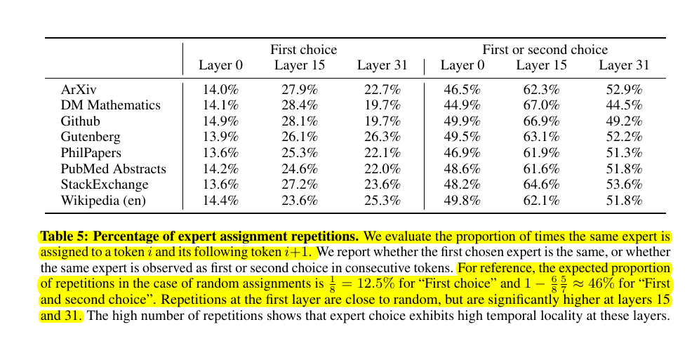

## 📌 How is Mixtral 8x7B is a dense 47Bn param model

📌 And NOT 8 x 7B = 56B - Why ❓

📌 Because in Mixture of Experts (MoE) models, only the FFN layers are treated as individual experts, and the rest of the model parameters are shared.

📌 Similarly, during Inferencing, assuming just two experts are being used per token, the inference speed (FLOPs) is like using a 12B model (as opposed to a 14B model), because it computes 2x7B matrix multiplications, but with some layers shared.

-------

MoE consists of two main elements:

A) Sparse MoE layers are used instead of dense feed-forward network (FFN) layers. MoEs we replace every FFN layer of the transformer model with an MoE layer, which is composed of a gate network and a certain number of experts.

B) A gate network or router, that determines which tokens are sent to which expert. How to route a token to an expert is one of the big decisions when working with MoEs - the router is composed of learned parameters and is pretrained at the same time as the rest of the network.

C) So the gating function is typically another small neural network within the MoE architecture, analyzes the input and calculates a probability distribution over the expert networks. The input is then sent to the expert with the highest probability, ensuring the most suited specialist tackles the task at hand.

C) Also note, while there are Inferencing services, that achieved an FP8 implementation that runs 3 experts for each token (as opposed to the default 2) - but activating more experts is detrimental since the model was trained to work with the contributions of just 2 top ones. That’s why activating 4 or more experts reduces quality

#######################################3333

From Mixtral 8x7B paper - The 8 Experts

📌 Mixtral 8x7B consists of 8 feedforward blocks (experts) in each layer. A router network dynamically selects two experts for each token at each layer, allowing access to 47 billion parameters while only actively using 13 billion during inference.

📌 Note that the 8 experts here are not trained or specialized in specific areas (i.e., there is not an ArXiv expert, and a Github expert).

Each expert (1-8) is chosen at each timestep meaning each token can come from a different expert.

What this table of experts is showing is how often the same expert was chosen for subsequent tokens. Some experts are chosen more often than chance for subsequent tokens but this has more to do with syntax rather than domain.

